 <!--

  
 
 -->

  

<h1 align="center" style="font-weight:900; font-size:48px; color:#34ff00;">
  Hey there 👋, Vishal Tamhane is here
</h1>
 

  
  
  
  

---

# 👨‍💻 Vishal Tamhane

### Full Stack Developer | Computer Engineering Student | Tech Enthusiast

---

## 🚀 About Me

- 🎓 3 rd -year Computer Engineering student at **Dr. D. Y. Patil Institute of Technology, Pune**
- 💼 Passionate about building robust, scalable, and user-centric web applications
- 🧠 Lifelong learner, always exploring new frameworks, tools, and best practices
- 🤝 Open to collaborating on innovative projects, hackathons, and community initiatives
- 🌐 Strong believer in the power of technology to solve real-world problems

---

## 🛠️ Tech Toolbox

  
   
  
   
  
   
  

---

---

  
  
  

---

  

